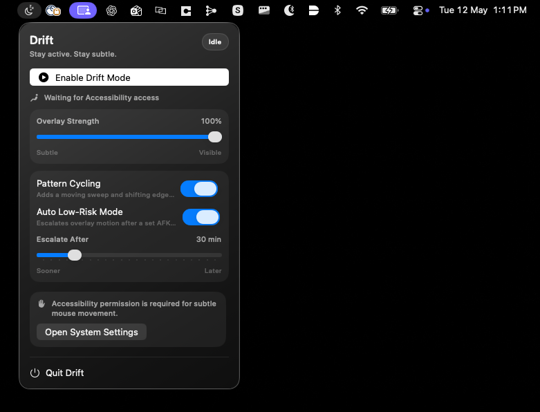
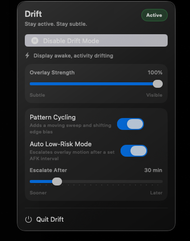

# Drift

Stay active. Stay subtle.

Drift is a lightweight native macOS menu bar utility that keeps the display awake, simulates tiny periodic mouse movement, and applies a nearly invisible drifting overlay to slightly vary pixel output over time on OLED displays.

## Screenshots




## MVP

- Menu bar-only macOS app with no Dock icon
- Single Drift Mode toggle and status indicator
- Power assertions to prevent display and idle sleep
- Small humanized mouse jiggle cadence
- Transparent multi-monitor overlay with slow graphite drift
- Accessibility permission onboarding

## Build

Open `Drift.xcodeproj` in Xcode 26 or newer and run the `Drift` target on macOS Sonoma or later.

The app needs Accessibility permission to simulate input events.

## Release

This repo includes a GitHub Actions workflow at `.github/workflows/release.yml` that builds a Release app bundle, packages it as a DMG, and attaches it to a GitHub Release when you push a tag such as `v0.1.0`.

```bash
git tag v0.1.0
git push origin v0.1.0
```

The workflow uses `scripts/create_dmg.sh` and only depends on tools already available on GitHub's macOS runners.

Current caveat: the produced app and DMG are not signed or notarized yet, so macOS Gatekeeper will treat them as unsigned downloads until signing and notarization are added.
